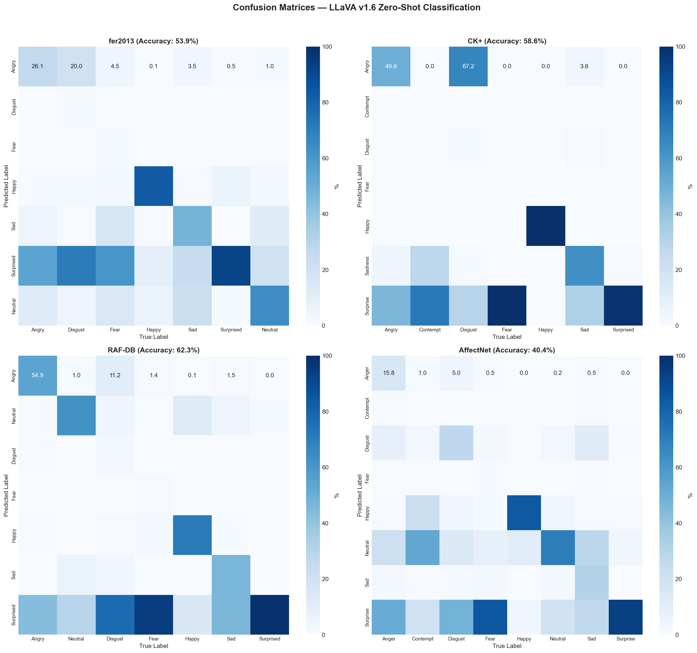
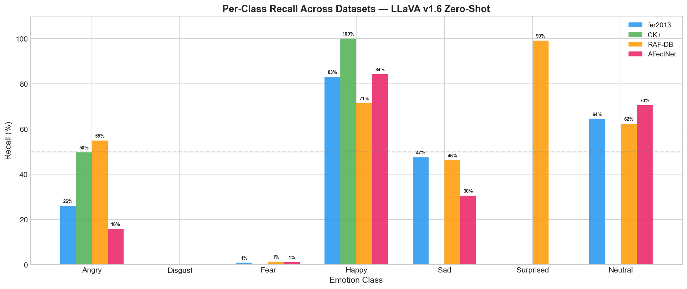
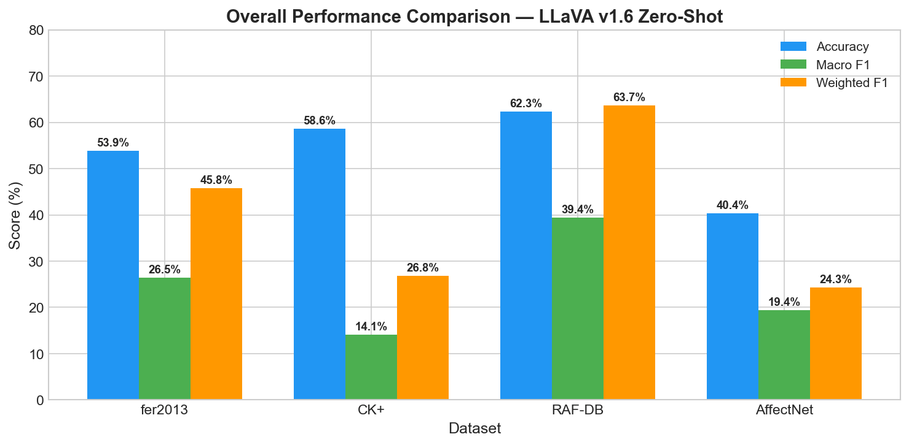

# 🎭 Facial Expression Classification with LLaVA (Zero-Shot)


## Overview

This project evaluates **zero-shot facial expression classification** using [LLaVA v1.6 (Mistral-7B)](https://huggingface.co/llava-hf/llava-v1.6-mistral-7b-hf), a state-of-the-art multimodal large language model, across **4 benchmark datasets** totaling **10,838 images**.

The model classifies facial images into emotion categories **without any fine-tuning or additional training** — relying solely on its pre-trained vision-language understanding.

### Emotion Classes

| angry | disgust | fear | happy | neutral | sad | surprised |
|:---:|:---:|:---:|:---:|:---:|:---:|:---:|
| 😠 | 🤢 | 😨 | 😊 | 😐 | 😢 | 😲 |

## Results

### Overall Performance

| Dataset | Images | Classes | Accuracy | Macro F1 | Weighted F1 |
|---------|--------|---------|----------|----------|-------------|
| **RAF-DB** | 3,068 | 7 | **62.29%** | 39.38% | 63.67% |
| **CK+** | 981 | 7 | 58.61% | 14.14% | 26.79% |
| **FER2013** | 3,589 | 7 | 53.89% | 26.47% | 45.77% |
| **AffectNet** | 3,200 | 8 | 40.38% | 19.44% | 24.30% |

### Confusion Matrices



### Per-Class Recall Across Datasets



### Overall Comparison



### Key Observations

- **Happy** is the most reliably recognized emotion across all datasets
- **RAF-DB** achieves the best accuracy (62.29%) — real-world images align well with the model's pre-training data
- **Fear** and **Disgust** are frequently misclassified — subtle expressions challenge zero-shot approaches
- **Surprise tends to be over-predicted** when the model is uncertain
- **AffectNet** has the lowest performance partly due to 8 classes (including Contempt)

## Model

| Property | Value |
|---|---|
| **Model** | [LLaVA-v1.6-Mistral-7B](https://huggingface.co/llava-hf/llava-v1.6-mistral-7b-hf) |
| **Architecture** | Vision Encoder (CLIP) + Language Model (Mistral-7B) |
| **Approach** | Zero-shot prompting (no fine-tuning) |
| **Precision** | float16 |

**Why LLaVA?**  
LLaVA (Large Language and Vision Assistant) combines a vision encoder with a large language model, enabling it to understand and reason about images through natural language. This makes it ideal for zero-shot classification tasks where labeled training data is unavailable.

## Datasets

| Dataset | Description | Source |
|---------|-------------|--------|
| **FER2013** | 48×48 grayscale facial images, 7 classes | [Kaggle](https://www.kaggle.com/datasets/msambare/fer2013) |
| **CK+** | Lab-posed facial expressions, 7 classes | Lucey et al., 2010 |
| **RAF-DB** | Real-world facial expressions, 7 classes | [Li et al., 2017](http://www.whdeng.cn/raf/model1.html) |
| **AffectNet** | Large-scale facial expression dataset, 8 classes | [Mollahosseini et al., 2017](http://mohammadmahoor.com/affectnet/) |

## Project Structure

```
├── README.md
├── requirements.txt
├── .gitignore
├── notebooks/
│   ├── zero_shot_classification.ipynb      # Inference pipeline
│   └── evaluation_and_visualization.ipynb  # Evaluation & plots
├── data/
│   └── LLAVA VERİLER.xlsx                  # Raw classification results
├── assets/
│   ├── confusion_matrices.png
│   ├── per_class_recall.png
│   └── overall_comparison.png
└── results/
```

## Getting Started

### Prerequisites

- Python 3.10+
- CUDA-compatible GPU (recommended, ~16GB VRAM for float16)

### Installation

```bash
# Clone the repository
git clone https://github.com/rumeysasakin/llava-facial-expression-classification.git
cd llava-facial-expression-classification

# Create a virtual environment (optional but recommended)
python -m venv venv
source venv/bin/activate        # Linux/Mac
# venv\Scripts\activate         # Windows

# Install dependencies
pip install -r requirements.txt
```

### Usage

**1. Run inference** (requires GPU):
```bash
jupyter notebook notebooks/zero_shot_classification.ipynb
```

**2. View evaluation & visualizations** (no GPU needed):
```bash
jupyter notebook notebooks/evaluation_and_visualization.ipynb
```

### Prompt Used

```
[INST] <image>
Classify this image into one of the given classes and describe it in one word:
angry, disgust, fear, happy, neutral, sad, surprised
[/INST]
```

## Limitations

- **Zero-shot performance**: Without fine-tuning, the model does not match supervised approaches
- **Prompt sensitivity**: Results can vary significantly depending on prompt wording
- **Image quality**: Low resolution (e.g., FER2013's 48×48) significantly degrades performance
- **Over-prediction of Surprise**: The model defaults to "surprised" when uncertain

## Future Work

- [ ] Fine-tune the model using LoRA/QLoRA on FER2013 or AffectNet
- [ ] Experiment with prompt engineering (chain-of-thought, few-shot)
- [ ] Compare with other multimodal models (GPT-4V, Gemini, InternVL)
- [ ] Evaluate on video-based emotion recognition datasets

## Tech Stack

- **[PyTorch](https://pytorch.org/)** — Deep learning framework
- **[Hugging Face Transformers](https://huggingface.co/docs/transformers)** — Model loading & inference
- **[LLaVA](https://llava-vl.github.io/)** — Multimodal vision-language model
- **[scikit-learn](https://scikit-learn.org/)** — Evaluation metrics
- **[Matplotlib](https://matplotlib.org/)** & **[Seaborn](https://seaborn.pydata.org/)** — Visualization

## License

This project is licensed under the MIT License — see the [LICENSE](LICENSE) file for details.

## Acknowledgments

- [LLaVA: Visual Instruction Tuning](https://arxiv.org/abs/2304.08485) — Liu et al., 2023
- [Hugging Face Model Hub](https://huggingface.co/llava-hf/llava-v1.6-mistral-7b-hf)
- FER2013, CK+, RAF-DB, and AffectNet dataset authors
